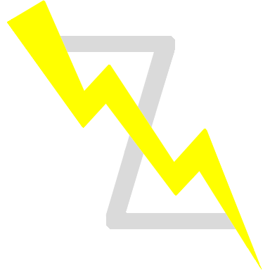

I am now an M.S. student at the Intelligent and Distributed Computing Laboratory ([IDC-Lab](https://idc.hust.edu.cn/)), [Huazhong University of Science and Technology (HUST), Wuhan](https://cs.hust.edu.cn) (advised by [Prof. Yuhua Li](http://english.cs.hust.edu.cn/info/1701/1581.htm)), majoring in Computer Science. My research interest lies in deep learning, weakly- and self-supervised learning, and graph mining.

## News

* 2024.01: My paper "Masked Graph Autoencoder with Non-discrete Bandwidths" is accepted as a research track in TheWebConf (WWW)'24! 
* 2023.04: My first paper "[CSGCL: Community-Strength-Enhanced Graph Contrastive Learning](https://arxiv.org/pdf/2305.04658.pdf)" w/ [Dr. Han Chen](https://github.com/HanChen-HUST) is accepted as a main track in IJCAI'23! Read my [Chinese blog](https://zhuanlan.zhihu.com/p/628116694) for more!
* 2022.09: I'm now a M.S. student at School of Computer Science and Technology, HUST, Wuhan.
* 2022.06: I got my double B.E. degree in Bioinformatics & Computer Science at HUST, Wuhan.

## Publications

#### Masked Graph Autoencoder with Non-discrete Bandwidths (WWW/TheWebConf'24 research track) 
**Ziwen Zhao**, Yuhua Li, Yixiong Zou, Jiliang Tang, Ruixuan Li  ~~[Code]~~ ~~[Blog]~~

We explore the non-discrete edge masking and prediction as a self-supervised GNN pre-training strategy. 

The discrete edge masking and binary link reconstruction strategy of existing topological masked graph autoencoders (TopoRecs) is insufficient to learn topologically informative representations, including blocked message flows, vulnerability to over-smoothness, and suboptimal neighborhood discriminability. We propose a novel model coined Bandana, which utilizes non-discrete edge masks - "bandwidths" - sampled from a continuous Boltzmann-Gibbs probability distribution. Bandana's bandwidth masking and prediction strategy is theoretically connected to regularized denoising autoencoders and energy-based models (EBMs). Bandana outperforms traditional discrete TopoRecs on node classification, link prediction, as well as graph manifold learning.

#### [CSGCL: Community-Strength-Enhanced Graph Contrastive Learning](https://arxiv.org/abs/2305.04658) (IJCAI'23 main track) 
Han Chen\*, **Ziwen Zhao\*** (Co-first author), Yuhua Li, Yixiong Zou, Ruixuan Li, Rui Zhang  [[Code]](https://github.com/HanChen-HUST/CSGCL) [[Blog]](https://zhuanlan.zhihu.com/p/628116694)

A graph contrastive learning framework aiming to preserve community strength throughout the learning process. 

Firstly, we present two novel graph augmentation methods, Communal Attribute Voting (CAV) and Communal Edge Dropping (CED), where the perturbations of node attributes and edges are guided by community strength. Secondly, we propose a dynamic ''Team-up'' contrastive learning scheme, where community strength is used to progressively fine-tune the contrastive objective. CSGCL performs well on 3 different kinds of downstream graph tasks, indicating the task generalizability of community knowledge for graph models.

## Early Open-source Projects

#### Counting is All You Need: Weakly-Supervised Immunohistochemical Cell Segmentation and Localization by Numbers [[Code]](https://github.com/Newiz430/CellSegmentation)

A multi-stage auto-immunoquantitative analytical model based on Multiple Instance Learning for immune cell counting, localization and segmentation. 

Taking immunohistochemistry-stained digital cell images as input, the model is merely supervised by positive cell counting labels and transforms whole-image (bag) level counting results into superpixel (instance) level classification results via the specifically designed adaptive top-k instance selection strategy.

This work has achieved 4th place in **Lymphocyte Assessment Hackathon** (LYSTO) Challenge. [Leaderboard](https://lysto.grand-challenge.org/evaluation/challenge/leaderboard/)

## Contact

Email: zwzhao@hust.edu.cn

Gmail: justn582@gmail.com

GitHub: [Newiz430](https://github.com/Newiz430)

Zhihu: [Newiz](https://www.zhihu.com/people/just-now-18)

---

This page uses Jekyll theme <a href='http://jekyllthemes.org/themes/gitbook/'>Jekyll Gitbook</a> by <a href='https://github.com/sighingnow'>sighingnow</a>.

 
 

